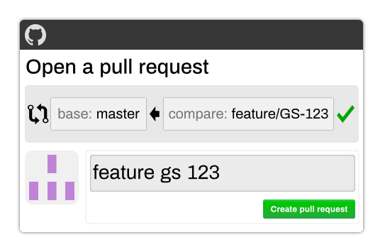
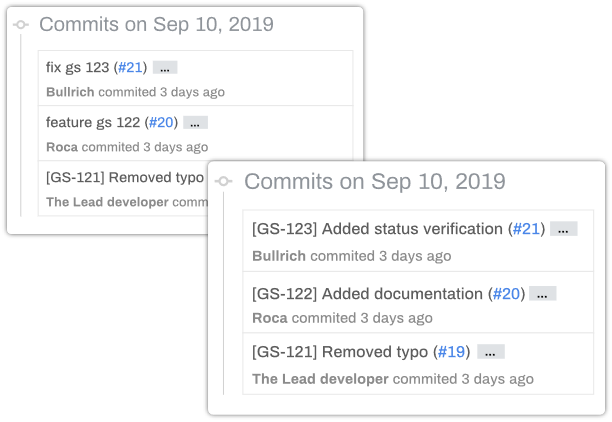
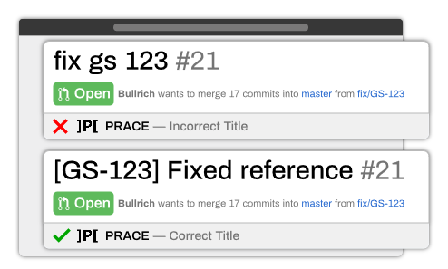

Technical analysis of creating the Prace action

# Introduction

On December 9th I released [Innerspace](https://innerspace.eu)'s first open source project: [Prace](https://github.com/innerspacetrainings/Prace.js). A GitHub action which works as a linter for Pull Requests. This project started originally as a simple pull request title regex evaluation which was hosted as a C# app on Azure Functions. I took this project as a pet project and worked on it to extend its coverage to a whole Pull Request, and, after working on it for two inconsistent months, it’s finally finished. And Prace now, instead of being a Pull Request title convention enforcer, is a _Pull Request Complete Convention enforcer._

By the way, Prace is an acronym for _Pull Request Automated Convention Enforcer_.

## The problem we wanted to solve

As a Lead at Innerspace, one of my main tasks is to do code reviews. We allow developers to merge their code once a Pull Request has been approved by squash and merging. The problem that GitHub gives with this is that the suggested commit message for the squashed commit is the Pull Request title, which is usually a badly formatted branch name.

When a developer merges his commit to the main branch, if he doesn’t manually change the title, it will be something like **feature gs 123** which doesn’t tell anything except the ticket number. We have a convention that looks like the following: **[GS-123] Added check for empty bodies**. The best way to enforce this, is to have a Pull Request title which would follow this convention, so, if a developer merges without looking at the title, the suggested title would still be a valid title for us. 

### Human errors

When I get a request to review a Pull Request, I usually jump to the code after reading the description and the ticket, and, **if** **I see that the title has the default title made from the branch name** I request the developer to change it. This, sometimes, goes over my head and I realize this **after **the developer merged his commit to the main branch (and it’s not a good practice to change the git history of the main branch).

For that reason, and after postponing it for a while, we created a small GitHub app that looked at the repo config file which would contain a single regular expression and evaluate the title of the Pull Request against it, giving a success or failed answer based on that.

The GitHub app was developed in C# using Azure functions and the [Octokit.net ](https://github.com/octokit/octokit.net)library. I created an app with permission to read PullRequests, read/write Status Checks and read a single file in the root directory. For testing I used [ngrok](https://ngrok.com/) because I needed to do modifications without deploying a new version of the app for every test. I wrote a bunch of ugly Pull Requests in a mock repository and ran every different kind of test I could.

I also became best friends with the [GitHub API](https://developer.github.com/v3/) (which, by the way, it still needs a lot of improvements).

This helped us a lot. No more worrying about wrong titles which would cause an ugly git history. You could open our _Pull Request** **_tab and you would see a very nice list of Pull Request, all with the title that we wanted them to have.

## Getting greedy

After finishing the first version of Prace, which only reviewed Pull Request titles, I wanted to improve it, make it open source and offer it to the community. I wanted to extend its coverage and remove the .NET dependency so any deployment server can use it.

### Typescript migration

We decided to migrate it to Typescript, which, by generating Javascript, meant it could work on almost any platform, Azure functions, Heroku and Google Cloud functions support Javascript natively, so if anyone wanted to deploy it they only needed to push the code and add the correct environment variables to have their own version of the app running.

The migration was very straightforward. We moved on to use the [@octokit/rest.js](https://octokit.github.io/rest.js/) library instead of the .Net, which works pretty similarly. The logic would work in the same way and I have some experience with Typescript, so I knew how to fill the missing gaps on the language migration (which could be summarized as using _map _and _filter _instead of _Select _and _Where_).

Once we finished the new migrated version and tested it, we decided to publish it. But, just to be sure we wanted to see if there was anything like this available online.

And, we [found](https://github.com/seferov/pr-lint-action) [some](https://github.com/seferov/pr-lint-action).

## Upping our game

When we found out about the other projects, I opted to take some more time to improve it. We had to offer something different to what the rest was offering.

There is when we decided to make it a full Pull Request linter. I researched the different parameters and what we could lint.

It had to be something easy to set up because no one likes configuration files and should also be clear of how to use it.

We decided to not only check the title but also:

* The body
* The branch name
* The reviewers
* The amount of reviewers
* The labels

### Customizing it

To certain logical levels, the system should be customizable, so every field that would use a regex, should also provide an error message, so the users would be capable of indicating the convention that the property should follow. Any other field would have a predefined error message (for example: _You need at least X amount of reviewers_).

The question was how to make it customizable. The project would clearly need a configuration generator, that would be a key different from this tool to any other similar one. Convenience. People use software because it’s convenient, so Prace should also be convenient, especially at the time of setting it up.

Using GitHub pages, Jekyll and [Alpaca forms](http://www.alpacajs.org/) I built a [website where users could generate the documentation](https://innerspacetrainings.github.io/Prace.js/) and from where they would only need to copy and paste it. Because this configuration take time to set up, and sometimes you want to share it to someone else (or keep the session if you close your browser) the config would be stored in the url as a GET parameter. 

That would be the key element in this system, is easy to set up, you can share it with a long URL and it only requires the user to copy and paste a file.

### Adding the functionality

The tough part (besides from designing a website with zero designer skills) was to add all the functionality for linting the Pull Request. It required an almost complete rewrite of the evaluation functions.

Most of data structures had to be modified to handle several values, the regular expression should be evaluated before using it to evaluate (to detect bad configurations) and we had to handle the difference in teams between names and slugs (_Unity Devs_ is the team name, but their slug would be _unity-devs_).

Most of this was handled with some conditions for those specific cases.

And then we found out the problem with reviewers.

### Reviewers vs Requested reviewers

There is a property of the Pull Request object that is the requested reviewers. These are all the users that have been requested to review a Pull Request, but there was a problem that we didn’t expect. If a requested reviewer gives his review, he stops being a requested reviewer and becomes a reviewer (without the requested part). And reviewers don’t appear in the Pull Request object.

After investigating I found that [there is an object for given reviews](https://developer.github.com/v3/pulls/reviews/#list-reviews-on-a-pull-request), I had to merge that with the requested reviewers to find the real amount of requested reviewers in the project.

Having two objects brought problems, because a comment from the author counted as a review and a reviewer can give more than one review, and if he is requested again, he will also be in the requested reviewers object. So I had to make sure that a reviewer:

* Was not the author of the Pull Request.
* Was counted only one time even if he gave two reviews or was also in requested reviewers.

### From App to Action

After managing that edge scenario (and writing 25+ unit tests to validate my logic) it didn’t make sense to make it as a GitHub App if GitHub Actions had been recently released. Prace doesn’t need a database nor much computing power, so all the logic could be handled in GitHub’s action system.

We decided to move it to a GitHub Action, and it was very simple. To use an action we needed the _@actions/core_ and _@actions/github_ package, which used the _@octokit/rest.js_ library under its hood which we were already using. Because our GitHub wrapper worked with dependency injection, we didn’t need to change anything there, just a reference to the API object.

In fact, we ended up removing code, as we didn’t need to authenticate the app anymore, we only used the github key given by the repo, and that allowed us to make changes.

The only big change, which was a shame, is that GitHub actions can handle nodeJS Actions, but not Typescript, as it can’t build nor run any pre execution action and we didn’t want to add the build to the repository, so we ended up using Docker as the execution system.

### Action logs can not be customized

A GitHub action is a Status Check which shows only the logs, but they don’t allow us to format it. For that we had to generate a different Status Check that is overwritten by each new action. We format it with Markdown and have a clean and pretty message.

This also brings a problem, if the user modifies the Pull Request _without pushing_ (they change the title, for example) it will trigger a new action to be executed but the old one will still be there. This results in both actions appearing as Status Checks, but, because the result is in a different Status Check, it’s always overwritten by the latest check, keeping it in a single and clean result.

We also have the problem that not all modifications force a new action to be executed. Currently, changing the title, pushing to the branch or changing the target branch to merge forces a new check to be executed, but, if the user assigns a new reviewer, this doesn’t trigger a new check, so there are times that Prace will set a Pull Request as failed, when the problem was that it didn’t execute again because GitHub doesn’t run the check under that condition. I’m afraid that is something we can’t modify.

### The final Pull Request

Before having the last pull request merged, I had the whole backend and frontend department review the code, as this would be our first open source project, and, as a company, it would reflect how people see our way of working.

It was also the perfect opportunity to have the repository evaluate itself.

After two weeks of requested changes and testing, I got all the approvals for the Pull Request and we could merge it. And in a very small celebration, we tagged the latest commit as _1.0.0_ and set the repository to _Public_.

Now, you can find the action in the [marketplace](https://github.com/marketplace/actions/prace-js).
