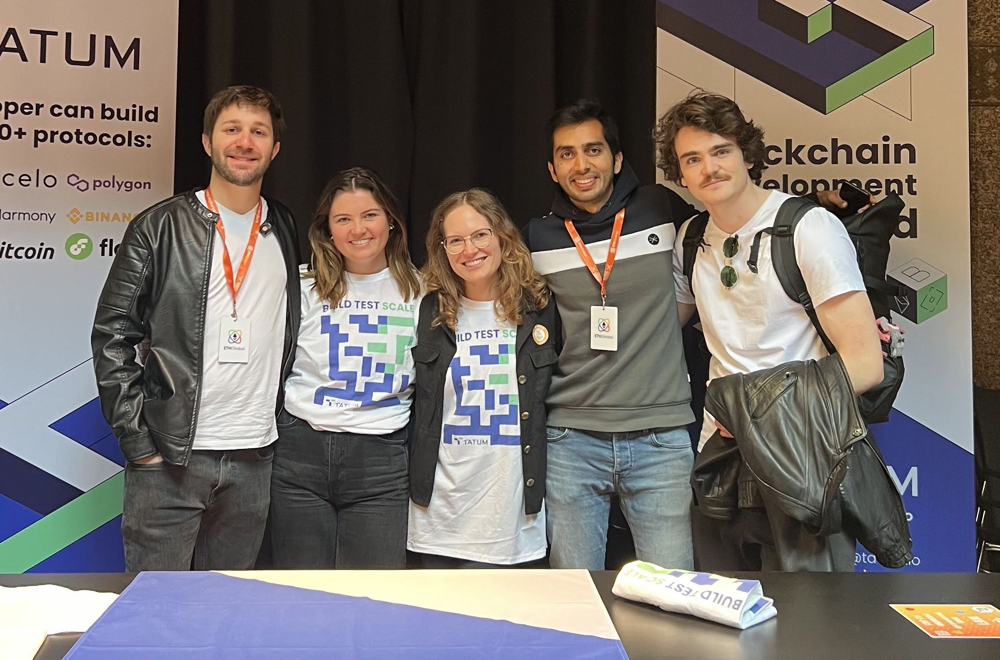
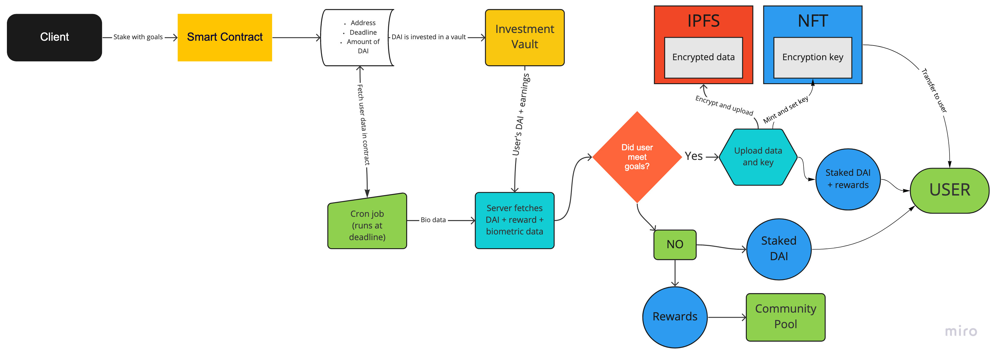
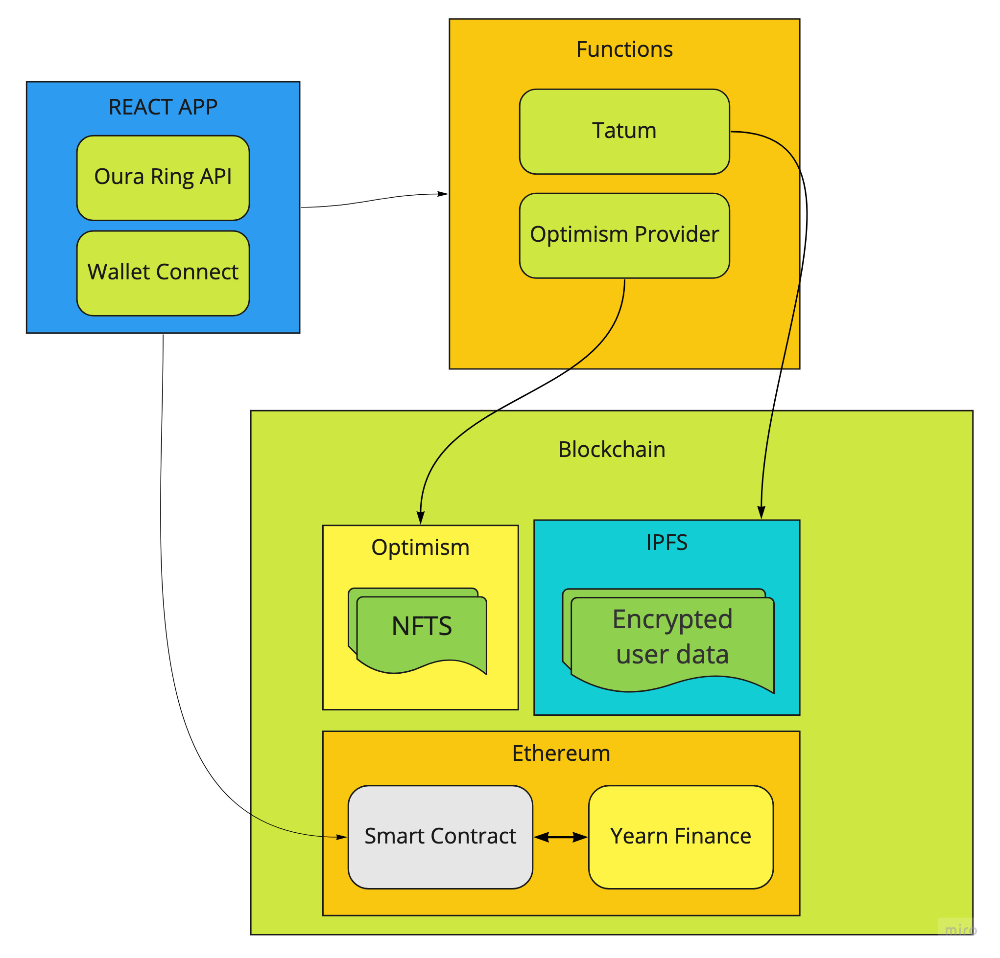

The Health.Wealth app was my team’s submission for the Amsterdam EthGlobal Hackathon. It **won 1st price in Best Overall Project Built with Tatum.io** and **two honorable mentions** by **Wallet Connect** and **Optimism Network**. This post analyzes how the dApp works and how it was built.

You can find the hackathon entry with its code [here](../../portfolio/health.wealth).

---

The project is a healthy habits dApp that allows users to invest in themselves (in the literal sense) by enabling them to set goals and be rewarded with staking yields when they achieve them. The user will also receive a data NFT at the end of their staking period.

The dApp has many features, which can be summarized below. It is:

- `DeFi`
- `DeSci`
- `GDPR` compliant
- Data market provider
- `NFT` generator

## The team

First of all, we couldn’t have done this without our amazing team! Health.Wealth was built by the following talented individuals:



- Alexandra Mccarroll [@XandraMcC](https://twitter.com/XandraMcC)
- Sarah Hamburg PhD [@Shamburgularara](https://twitter.com/Shamburgularara)
- Oliver Klingefjord [@klingfjord](https://twitter.com/klingfjord)
- Ashwin Konale [@konaleashwin](https://twitter.com/@konaleashwin)
- Javier Bullrich [@javierbullrich](https://twitter.com/javierbullrich)

Alexandra and Sarah also wrote a blog post regarding this project. You can find it [here](https://mirror.xyz/0x8b2622EEA6ca1cD84423a63DD551bAC913BAc932/lHCTbVrq3MmjGk_xiE-pnosS9ubS7hDn7Vn2I1cuPAc).

## Flow

Let’s look into the flow to understand how it works:



A user needs to sign into the app using their web3 wallet and their biometric sensor (Oura Ring, FitBit, Muse BCI, Apple Watch, etc.). For the PoC we only supported Oura’s API and we used Wallet Connect to handle authentication.

After this they decide to set a goal, for example: _Meditate for 10 minutes, 4 times per week for a duration of 4 weeks_.

Then, finally, they stake a given amount of DAI (between 10 and a 100) and these funds get locked for the duration of 4 weeks.

Here is where the magic happens:

- The frozen DAI get invested using [yearn.finance](https://yearn.finance/).
- Once the 4 weeks finish, a cron job fetches the user biometric data and analyze it to see if the user accomplished their proposed goals.
- If the user achieved their goals:
    - We fetch the staked DAI + the rewards and return it to the user.
    - We encrypt the user biometric data and upload it to [IPFS](https://ipfs.io/) using [Tatum](https://tatum.io/).
    - We mint an NFT from a custom ERC721 contract that we have deployed on [Optimism](https://www.optimism.io/)’s Kovan network and set two parameters:
        - The URI, pointing to the CiD of the uploaded encrypted data.
        - A private field which contains the encryption key that only the owner of the token can access.
- If the user did not achieve their goals:
    - They receive the staked DAI.
    - The rewards are moved into a community pool that supports public goods and powers the gas for the contracts.

For the users that achieve their objective, they not only earned rewards from their staking, but they also now own a token with their data that they can profit from.

They can permission this data to scientists, or to third party researches. They can also burn it if they wish and the key would be lost, or they can just store it as an achievement of what they accomplished. It’s their data so they are free to use it however they wish to do so.

We never store the user’s biometric data, as soon as we mint the NFT all the data gets purged, so this meets `GDPR` compliance.

## The stack



The dApp is a mix of Web2 and Web3.

We used Firebase for hosting our website, database and lambda functions.

The whole front end of the app is built using

- React framework with Typescript
- Oura’s OAuth API to fetch an access token
- Wallet’s connect API to enable the user to interact with the smart contract
- `ethers.js` to contact the staking contract

The front end itself is quite minimal but gives us all the important information and allows the user to interact with the staking contract.

When the user’s deadline arrives, a cron job, which is a Firebase function, will fetch the user’s biometric data and verify that the goals were meet. Based on the result, the system will execute a function in the smart contract using `Tatum` as the provider.

The system will also encrypt this data and, using `Tatum` again, it will upload the given data into the `IPFS`.

For the Web3 side, we used a mix of Ethereum and `Optimism`.

We wanted to host everything in `Optimism` as it’s faster, but the other providers didn’t support it.

One hurdle we faces was that our yielding provider, which is `[Yearn.Finance](http://Yearn.Finance)` and `Tatum` don’t currently support Optimism.

The `ERC721` modified contract was deployed into the `Optimism` Kovan network, and we used `ethers.js` to call the function to mint a new NFT.

As `Optimism` is an `Ethereum L2 chain`, the user will have the same wallet address which allows us to send the NFT to them without them having to migrate to the Optimism network.

## The staking contract

The smart contract which handles the staking is a simple contract which implements a `struct`, called _UserGoals_, which contains the important data, and a `map` which uses the user address as the key.

The _UserGoals_ struct contains three fields, the unix time for the deadline of the user goals, the amount of DAI they staked and, finally, the shares that their stake was worth.

```solidity
struct UserGoals {
    uint256 deadline;
    uint256 stakedAmount;
    uint256 shares;
}

mapping(address => UserGoals) private userGoals;
```

### Converting the stake into an investment

When a user stake their DAI, we need to invest it for them to obtain earnings from DeFi yield protocols, we do that using [Yearn Vaults](https://yearn.finance/#/vaults), which require some boilerplate code.

We need to connect to their Vault smart contract, so we first set up the interface for it. You can find the interface [here](https://github.com/yearn/yearn-vaults/blob/main/contracts/Vault.vy), but, for the sake of simplicity, we are going to use a minimized version of the interface:

```solidity
// SPDX-License-Identifier: GPL-3.0
pragma solidity >=0.7.0 <0.9.0;

interface Vault {
    function deposit(uint256 _amount) external returns (uint256);
    function withdraw(uint256 _amount) external returns (uint256);
    function pricePerShare() external view;
}
```

We connect the interface using the address, for the sake of the PoC we hardcoded it: `Vault yDai = Vault(0xF4869878d11145D65136A7e3c8CA36a5A5059dFa);`

After we have the address of the vault in a variable, we can use it to transfer the funds from the user to the vault by calling:

`uint256 shares = yDai.deposit(amount)`

Once this method is called, it will return the amount of shares that were returned for the amount it was deposited.

The shares are a value that will be constant in this case, as the value of the shares can increment while time passes but the amount of shares will not.

We start with a given value, (e.g.: `1 share == 1 DAI`), but after 4 weeks it can happen that the value of each share changes (e.g.: `1 share == 1.1 DAI`) so it’s important to store how much the user deposited and how much shares was it worth.

We end up saving all this values in the user mapping object:

`userGoals[msg.sender] = UserGoals(deadline, amount, shares)`

Here you can see a small example of all this code working together:

```solidity
address DAI = 0x51998830821827e12044a903e524b163152eFFd4;
Vault yDai = Vault(0xF4869878d11145D65136A7e3c8CA36a5A5059dFa);

function stake(uint256 deadline, uint256 amount) public {
		dai.transferFrom(msg.sender, address(this), amount);
		dai.approve(address(yDai), MAX_INT);
		uint256 deposited = yDai.deposit(amount);

		userGoals[msg.sender] = UserGoals(deadline, amount, deposited);
}
```

### Recovering the investment

Once the deadline has been reached, the user needs to recover his staked DAI and, if they achieved his objective, the rewards too.

To withdraw all the funds we need to simply call another method from the `yDai` contract with the amount of shares we wish to withdraw:

```solidity
uint shares = userGoals[target].shares;
uint256 funds = yDai.withdraw(shares);
```

This will give us all of the deposited amount plus the earnings that were obtained, but it will not tell us how much earnings we obtained.

So how do we find this out? Easy, with the original amount that we stored in the user map:

```solidity
uint originalStake = userGoals[target].stakedAmount;
uint earnings = funds - originalStake;
```

Now, if the user achieved his objective, we transfer the whole value of `funds` to them, but, if they didn’t, we only transfer the value from `originalStake` to them.

---

Special thanks to [@saltyfacu](https://twitter.com/saltyfacu) for his help at integrating the contract with our codebase.

## The Biometric data and the NFT to decrypt it

When fetch the user data we encrypt it using a unique encryption key. Then, this data is uploaded to `IPFS` using `Tatum.io`.

Once the file is uploaded and we have the Content Identifier (`CID` for short) we mint an NFT that has the ability to access this data.

### The Biometric NFT

For the smart contract we used OpenZeppelin’s `ERC721` contract with the storage option and a few modifications. The contract itself is still compatible with all the marketplaces, but the difference is that we added an extra method only accessible to the owner of the NFT.

Every time we mint a new NFT, we need to set up three fields:

- The owner of the NFT
- The `CID` where the encryption data is stored
- The encryption key

The owner of the NFT is used by the default `_mint` function developed by OpenZeppelin while the `CID` is used as the token’s URI.

The encryption key, instead, is stored in a custom map: `mapping(uint256 => string) private biometricsStorage;`

Each key is stored using the id of the token as the key and the encryption key as the value. The owner of the token can call the method `getEncryptionKey` which will return the key as a string.

```solidity
function getEncryptionKey(uint256 tokenId) public view returns (string memory) {
    require(ownerOf(tokenId) == msg.sender, "User is not the owner!");

    return biometricsStorage[tokenId];
}
```

The method itself is not safe nor bullet proof, but it was a quick example of what the NFT would be used for.

If the owner of the NFT wishes to access the biometric data stored in `IPFS` then they first need to download it using the Token URI as the `CID`, and then, after obtaining the encryption key by calling `getEncryptionKey`, they can decrypt it.

## What was missing

Now let’s analyze those pieces that we would have loved to add but didn’t have time:

- Better encryption of user data with different encryption algorithms such as homomorphic encryption.
- An NFT listing page, so we would be able to see the NFTs that we own, and even decrypt the information stored in IPFS.
- A status page, so you can know how your progress is coming along, how many days are remaining and what’s the current earnings from your stake.
- A better way of storing the encryption key, in it’s current scenario it is not hard for hackers to access other user’s encryption keys.
