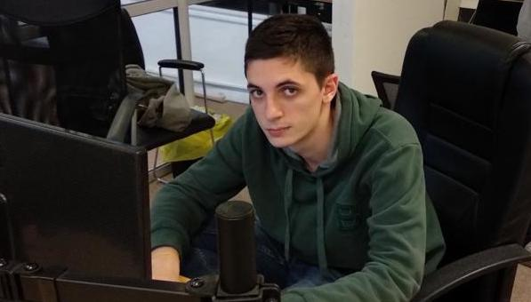

Today I want to drift away from talking about myself and my work. Today I want to talk about a friend.

This is Pato, which in English means Duck. 

Pato is a fantastic engineer, I worked next to him, shoulder to shoulder, for two years in [Jam city](https://www.jamcity.com/). 

When Pato arrived, I, as a novice engineer, wanted to show him how cool my setup was in my Macbook. It was my first Macbook and I had just discovered [Oh my Zsh](https://ohmyz.sh/). I was like a kid who just came back from the candy shop. He already knew that terminal, he knew all the plugins one could add, he was unnecessarily proficient in Nano and was a master of UNIX. So he replied kindly, he suggested plugins that I didn’t know about and terminal alternatives. Oh boy, he managed to get me more pumped about my terminal.

As a matter of fact, it was because of him that I installed my first Linux distro. I had experimented with Ubuntu and CentOS in the past, but I never used them as my main operating system. He was very passionate about a particular distro: [Linux Solus](https://getsol.us), an operating system with the very nice looking GUI *Budgie* that uses the [eopkg](https://en.wikipedia.org/wiki/Pardus_(operating_system)#PiSi_package_management) package manager. He convinced me and I replaced the OS in my notebook for Solus.

I only knew the `apt` and `yum` package manager and had never really tried to make Linux my main operating system. I struggled with a lot of things during the setup days, (those days when you are installing the base software, finding the drivers for your particular machine, learning how to use the package manager, etc.) but most of these things he knew already, he had already experienced them in the past. I would come up with a different problem every day and he would guide me during our work shift. His suggestions flooded the space between us and during that time, I learned how to fix problems so I could actually start to try them during the night. He also taught me how to debug missing dependencies which helped me a lot. I wrote a (now outdated) tutorial on [installing the Unity Game Engine in Linux Solus](https://forum.unity.com/threads/tutorial-installing-unity-on-solus-os.490709/) with that knowledge. I’m very proud of that blog post, it was my first “discovery”. Something that no one had tried before and no one knew how to do it.

You always need someone who teaches you how to learn new things. Pato was that person for me.

But he fulfilled another very important role in my life. 

He was a rival, in a good way. Someone that was always challenging me, making me want to improve and grow, and I want to believe that, in return, I had the same effect on him.

During every lunch break, we would be talking about software technicalities or miscellaneous concepts and discuss thought experiments. We would have random questions, for example, [what language is used to develop Java itself](https://stackoverflow.com/questions/1220914/in-which-language-are-the-java-compiler-and-jvm-written). (Let me save you a click, it’s Java. When a language becomes mature enough that it can develop itself, it goes through the process of [bootstrapping](https://en.wikipedia.org/wiki/Bootstrapping_%28compilers%29), of compiling itself). We would create proofs of concepts and dissect them several times, trying to improve them together. We would share every tidy bit of new information we would have discovered. It was a rivalry, not because we wanted to surpass the other person, but because we didn’t want to be left behind by the growth of the other one. 

We created our own growth feedback loop.

We embarked on many small projects, but none of them got really far away, but we were learning. Actually, we were about to start our [own company](https://geminis.io/) with another amazing college (who I’ll mention in a different blog post), but life took a different course for me and sent me to Austria. I’m very proud of my achievements, but I strongly believe that if we would have started that company it would have been an amazing company.

He started a new blog for which I’m very excited to see what he will write about: [https://notquine.dev/](https://notquine.dev/). 

Of course, being him, he taught me something new with the name of the blog (a [quine is a computer program which takes no input and produces a copy of its own source code as its only output](https://en.wikipedia.org/wiki/Quine_(computing))).

Pato is more than a friend to me, he has been my coworker, mentor, pupil, rival, and business partner. And I believe that everyone needs to find their own Pato, someone who will challenge you, who will criticize you when you need it, who makes you grow, who makes you **want to grow**, to become a better professional.

Because, while you should always believe in yourself, having help and guidance from others can take you even further away.
